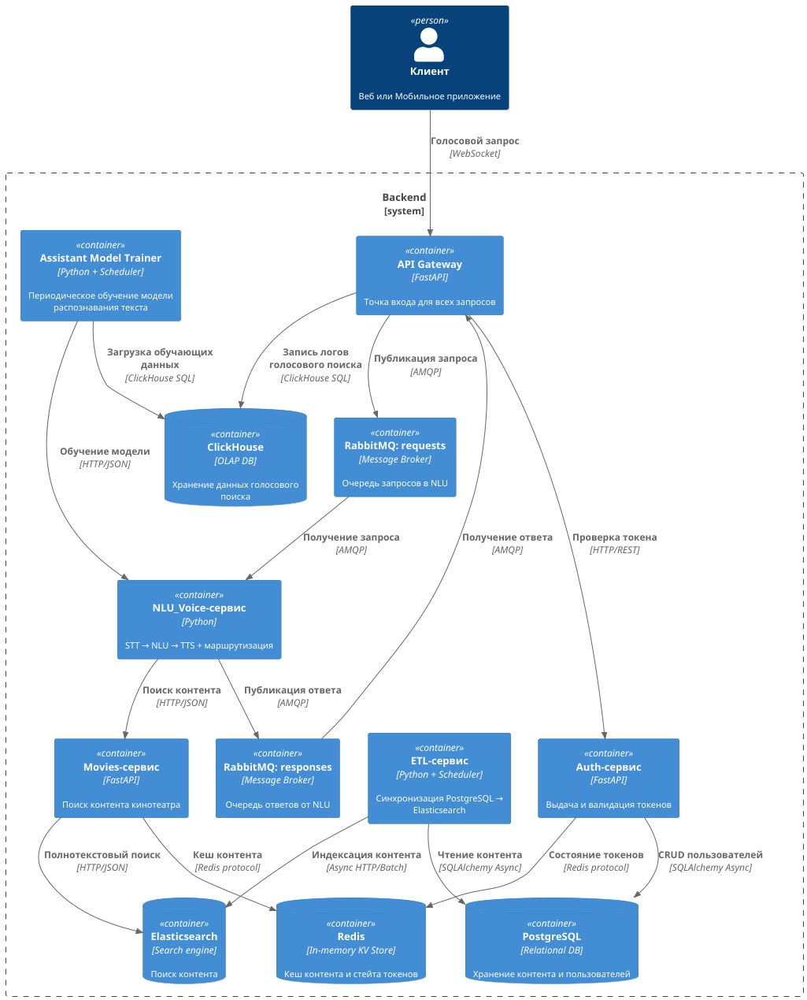
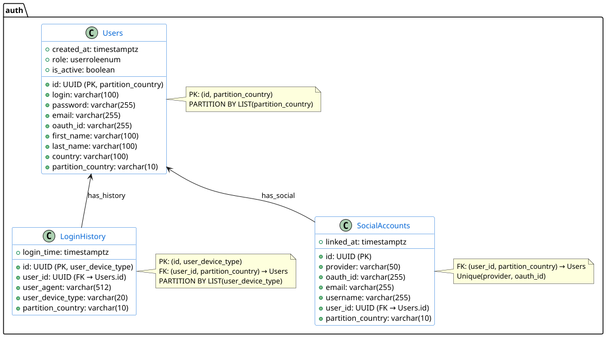
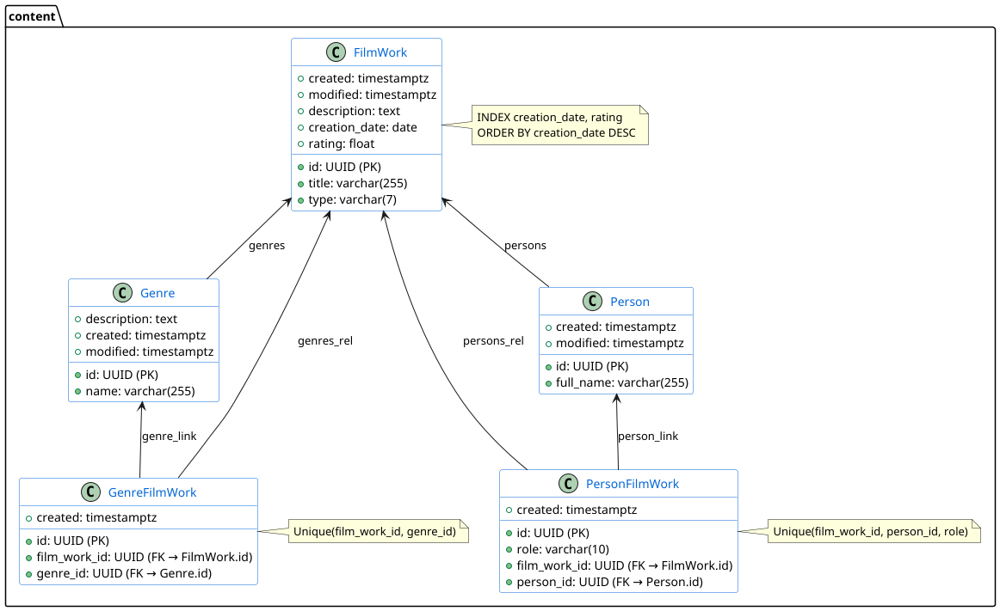
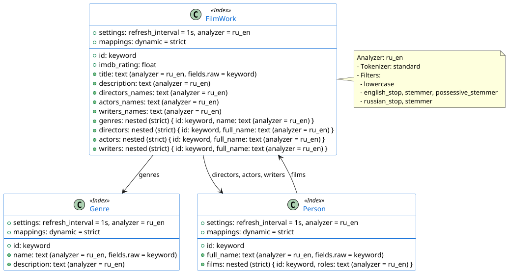

# Cinema Assistant Project

**Goal** – implement integration between the movie search service and the voice assistant.

---

🔹 **Run the project (in the current directory):**
```sh
docker compose up -d
```

---

🔹 **Run tests (from the `tests` directory):**
```sh
docker compose -f ./docker-compose-apps.yaml -f ./docker-compose-services.yaml -f ./docker-compose-tests.yaml up -d
```
🔹 **Run tests with service ports exposed (from the `tests` directory):**
```sh
docker compose -f ./docker-compose-apps.yaml -f ./docker-compose.override.yaml -f ./docker-compose-services.yaml -f ./docker-compose-tests.yaml up -d
```
🔹 **Run services with ports exposed for test development (from the `tests` directory):**
```sh
docker compose -f ./docker-compose-apps.yaml -f ./docker-compose-services.yaml -f ./docker-compose.override.yaml up -d
```

---

## Technology Stack
- Python 3.12  
- Containerization:
  - **[Docker](https://docs.docker.com/)**  
- Web Servers:
  - **[Uvicorn](https://www.uvicorn.org/)**  
  - **[Nginx](https://nginx.org/en/docs/)**  
- REST Frameworks:
  - **[FastAPI](https://fastapi.tiangolo.com/)**  
- Search Engine / Database:
  - **[Elasticsearch](https://www.elastic.co/guide/en/elasticsearch/client/python-api/current/index.html)**  
  - **[RedisCluster](https://redis-py.readthedocs.io/en/stable/index.html)**  
  - **PostgreSQL** (**[SQLAlchemy ORM](https://docs.sqlalchemy.org/en/20/orm/)**)  
- Data Models:
  - **[Pydantic](https://docs.pydantic.dev/latest/)**  

## Project Architecture
### Main project modules:
- Cinema service (content delivery service)  
- ETL service  
- Auth service  
- Movies service  
- API gateway  
- Voice service  

Project architecture diagram:  


## Main PostgreSQL Models
- **FilmWork** – Movie  
- **Genre** – Genre  
- **GenreFilmWork** – Links a Genre to a Movie  
- **Person** – Person  
- **PersonFilmWork** – Links a Person to a Movie  
- **User** – User  
- **LoginHistory** – User login history  
- **SocialAccount** – Social account  

PostgreSQL schema diagrams:  
  


## Elasticsearch Index Schema


---

# Development Guidelines
## GitFlow
### Branches:
- **main** – the primary (stable) branch containing code ready for review  
- **develop** – the working branch containing the latest development codebase  

### Branch workflow:
- New feature development: branch from `develop` → `feature/...`  
- Bug fix in a new feature: branch from `develop` (or `main`) → `fix/...`  

## REST-URI:
### Versioning:
- **Stripe**-style versioning ([docs](https://docs.stripe.com/api/versioning))  

### WebSocket event naming patterns:
TODO: add

## Code Style:
- Follow **[PEP8](https://peps.python.org/pep-0008/)**  
- Docstring format – **[Epytext](https://epydoc.sourceforge.net/manual-epytext.html)** (recommended)  
- Linters: **[Flake8](https://flake8.pycqa.org/en/latest/)** or any other compatible linter (recommended)  
- **[Pre-commit](https://pre-commit.com/)** hooks (recommended)  